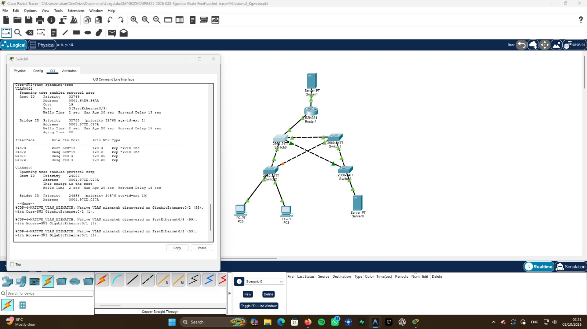
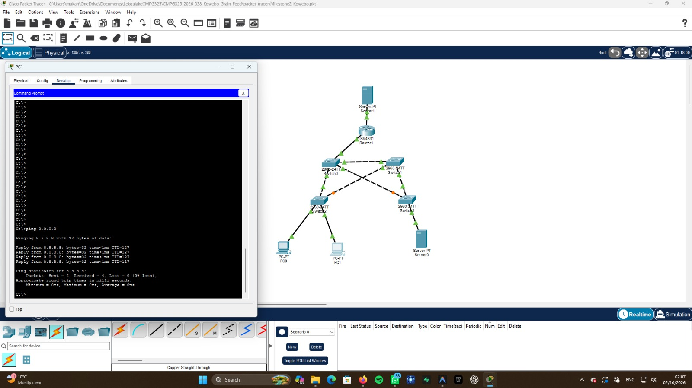
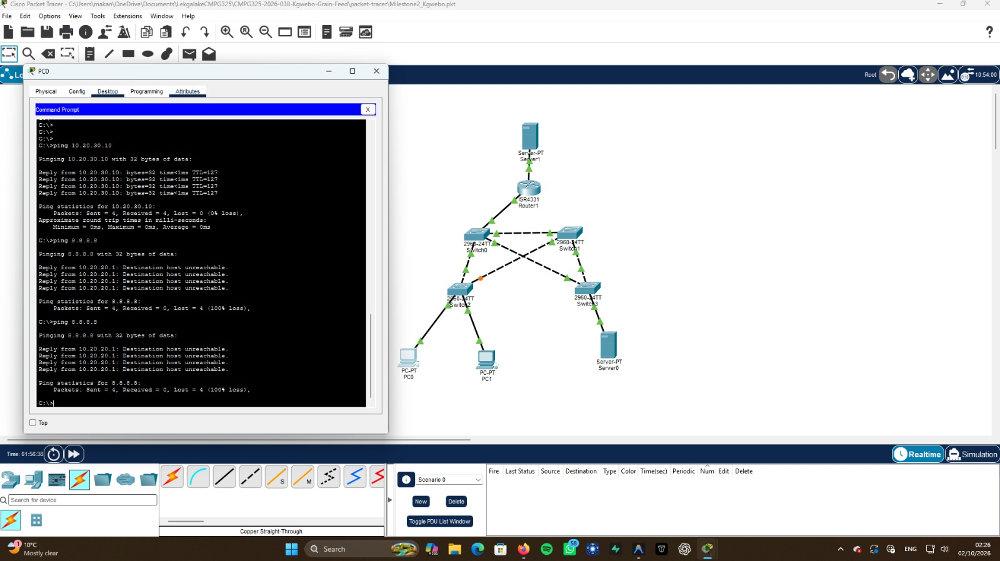
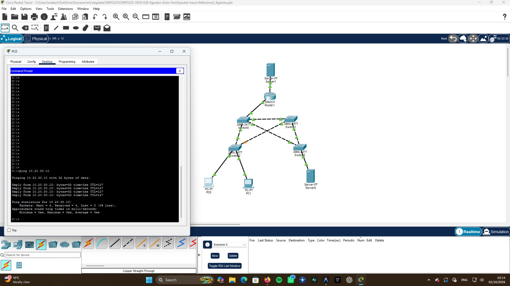

# Testing and Verification

This document outlines the testing procedures used to verify that the client's network requirements have been met. The screenshots below prove the functionality of the implemented Cisco Packet Tracer network.

## 1. STP Loop Prevention & Root Design

**Objective:** Verify that STP is running, preventing loops, and that the root bridge design is functioning as configured.

**Testing Steps:**
1. Open `Core-SW1` CLI.
2. Run the command: `show spanning-tree`
3. Verify that `Core-SW1` is the root bridge for the VLANs.

**Evidence (Root Bridge Configuration):**

---

## 2. Internet Access Restrictions (Management vs. Staff)

**Objective:** Verify that the ACL correctly restricts the Staff VLAN from accessing the Internet, while allowing the Management VLAN.

### Test A: Management Internet Access
**Testing Steps:** Ping an external Internet server (`8.8.8.8`) from the Management PC.
**Expected Result:** Successful.
**Evidence:**

### Test B: Staff Internet Blocked
**Testing Steps:** Ping an external Internet server (`8.8.8.8`) from the Staff PC.
**Expected Result:** Failed (Destination host unreachable), proving the ACL works.
**Evidence:**

### Test C: Staff Local Access
**Testing Steps:** Ping a local server (`10.20.30.10`) from the Staff PC.
**Expected Result:** Successful, proving Staff is only blocked from the internet, not the local network.
**Evidence:**

